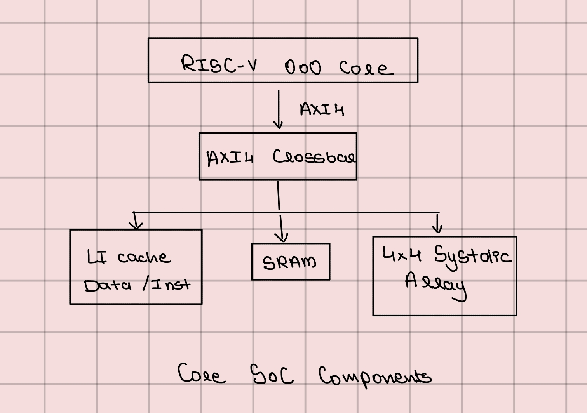

# RISC-V OoO SoC with Systolic Array Accelerator

A RISC-V out-of-order processor integrated with a 4x4 systolic array
accelerator, designed and verified from RTL through tape-in ready GDS.

## Overview

This project explores the architectural challenge of feeding a fixed-function
accelerator at full bandwidth. The SoC pairs a general-purpose RISC-V
out-of-order core with a systolic array for matrix multiplication, connected
over an AXI4 interconnect. The core handles control flow and orchestration;
the systolic array handles the compute. The interesting design problems were
in the memory system sizing the scratchpad, deciding cache vs scratchpad
tradeoffs, and ensuring the interconnect could sustain the array's bandwidth
needs.

  

## Components

| Block | Description |
|---|---|
| RISC-V OoO Core | RV32I, 16-entry ROB, 8-entry reservation stations, register renaming (RAT), bimodal branch predictor |
| Systolic Array | 8x8 INT8 PE grid, weight-stationary dataflow, AXI4-Stream interface |
| On-Chip SRAM | Single shared memory for instructions and data, IHP PDK macro, accessed directly over AXI4 |
| AXI4 Crossbar | 2 masters, 4 slaves, address-decoded routing with round-robin arbitration |
